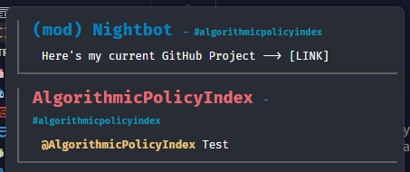
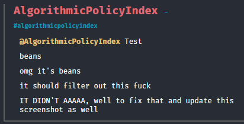

# ChatPlays
 This is my Twitch Chat Plays code!  
 I usually work on this code on stream, but I mostly refactor offline.

 This program is also a bit more than just Chat Plays though! I personally didn't like the chat overlays offered to me, so I decided to make my own. This code is also a Terminal Chat. I use ANSI for color coding in the terminal, I'll take time out next weekend when I have the chance to make a more stream lined Index.ts file, mostly to make setting your own colors and stuff much easier.

 Note: This program only reads messages in Twitch chat, so it will not type in your channel and requires no permissions to run.

# Electron Chat
The Mod and Broadcaster looks like  
  
The default chatter color is a purple, which I am unable to properly show as of right now

Message history  


# Chat Plays
 The features of ChatPlays is really anything.  
 All you need to do is make sure your controls are properly set. 

 > **Disclaimer: While this is just using the Windows API to do inputs, you may still get banned from games. You shouldn't, as this doesn't hook into games nor give advantage to the player, but I do not know the extent some Devs will go with automated inputs. Example: Helldivers 2 Stratagems. However, that would then disallow the use of Macros/AutoHotKey. You should be fine, but do not come crying to me if you do.**  
 **I only play with people that know about my Code, so there is no hard feelings at the end of the day.**

 You can read over how I handle the general controls of games inside the [Commands Folder](src/commands/)  
 However, what if you wanted to do something custom, say, the [Helldivers 2 Stratagems!](src/commands/Helldivers2.ts)  
 Is there an input you need? You can make it yourself! Otherwise, it should be as streamlined as it needs to be.

 However, I'll let you know how to use the [Control Scheme](src/ControlHandler.ts)... Since I need to rework that soon.
 Right now, there is no obvious way to differentiate between Mouse and Keyboard. Other than Key and Dir

 ```ts
 const Controls = {
	// Keyboard
	walkforward: { Key: nut.Key.W, Amt: -1 }, // Holds Key Down
	stepforward: { Key: nut.Key.W, Amt: 500 }, // Taps key for 500ms before releasing
	stop: { Amt: 0 }, // Releases all held keys

	// Mouse
	lookup: { Dir: "up", Amt: 250 }, // Moves mouse up 250 pixels (Uses Python, because nut.js/robot.js had positioning issues at the time of creation of this project.)
	shoot: { Dir: "lclick", Amt: 500 }, // Presses Left Click
	aim: { Dir: "aim", Amt: 0 }, // Switches between Holding Right Click and releasing
	scrollup: {Dir: "sup", Amt: 500} // Scrolls up 500 "steps"
 }
 ```

 Other than that, that's it! Super Simple right?

# Work Load / Plans
 - Channel Point reward to start for viewers (I'm not affiliated, so that's hard to test)
 - Helldivers Controls
 - Set Command - Check if game name matches names in Commands folder.
 - Electron App
 	- Pop-ups - Followers and the like ?
 - Github file for game controls
	- Fix the controls JSON
	- 
 - Add BunJS internal function support
 

# Setup (WIP)

### Settings
Editing settings is as simple as open the [.json in the "src"](src/settings.json) folder.
Inside it, you will find:
```json
{
	"streamer": "CHANNEL NAME",
	"processTitle" : "ChatPlaysCMD",
	
	"width": 441,
	"height": 665,
	...
}
```

### Colors  
> ! NOTE: I AM LEAVING THE BACKGROUND COLOR AND `<li>` BORDER COLOR HARD CODED IN THE [STYLES](frontend/style.css) !
```json
{	
	...
	"username": "#c678dd",
	"moderator": "#0184bc",
	"broadcaster": "#e06c75",
	"ping": "#e5c07b",
	"channel": "#0997b3",
	"message": "#fafafa",
	"bracket": "#dcdfe4"
}
```

### Running
> **!** You'll need to edit any thing to match your package manager, I personally use [Bun](https://bun.sh) **!**

Install packages via `bun i`  
Edit settings to your preferred options, such as above  
Run `bun run electron`  

There shouldn't be too much issues after that, if there are, feel free to note them in Issues